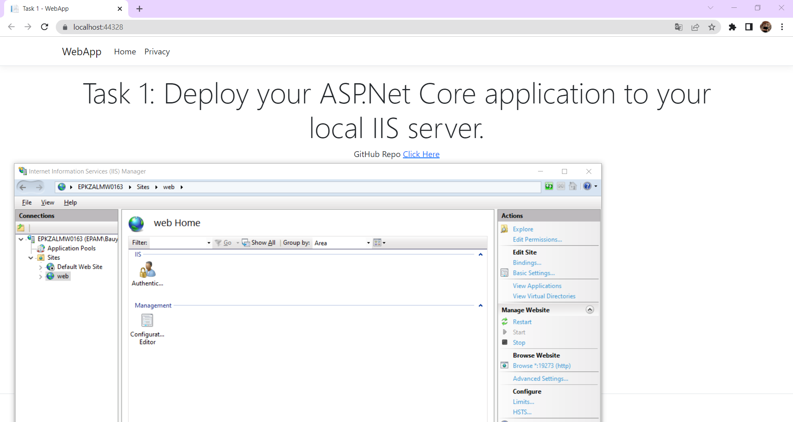

# Hosting and Deployment

## Task 1 Deploy your ASP.Net Core application to your local IIS server

- Created Web Application
- Generate app to folder
- Run in IIS

Result:
Running Application in local machine 

---

## Task 2 Deploy your ASP.Net Core application to Azure App Service.

- Created a new resource group.
- Created an azure webapp.
- Published app to a azure webapp.

- Login to Azure Portal and verify that all resources were created. 

- Find App Service and open the app link **https://aldakul.azurewebsites.net/** in the browser to verify it is up and running as expected.

